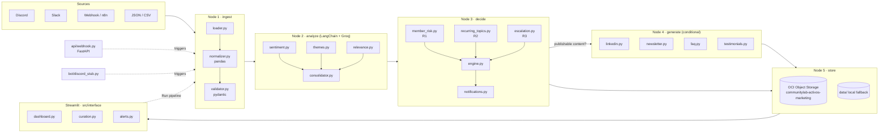

# CommunityLab

CommunityLab is an intelligent transformation engine for digital communities.
It ingests raw conversations from Discord, Slack, webhooks and flat files,
normalizes them into a single schema, and feeds them into an AI pipeline
(LangGraph + LangChain + Groq) that produces analyses, content and decisions.

## Project layout

```
communitylab/
├── src/
│   ├── ingest/         # Loaders, normalizer and validator
│   ├── analysis/       # Sentiment, themes, relevance + consolidator
│   ├── prompts/        # System prompts for analysis and copywriting
│   ├── orchestration/  # LangGraph graphs wiring the pipeline together
│   ├── generators/     # Content generators (LinkedIn, newsletter, FAQ, testimonials)
│   ├── decisions/      # Decision engine: member risk, recurring topics, escalation
│   ├── oci/            # Oracle Cloud Infrastructure integrations (Object Storage)
│   ├── interface/      # Streamlit UI
│   ├── api/            # HTTP API layer
│   ├── bot/            # Discord / Slack bot adapters
│   └── utils/          # Shared helpers (Groq LLM client with fallbacks)
├── tests/              # pytest suite
├── data/sample/        # Sample datasets (messages.json)
├── scripts/            # One-off / maintenance scripts
├── notebooks/          # Exploratory notebooks
├── n8n/                # n8n workflow exports
├── docs/               # Project documentation
├── requirements.txt
└── README.md
```

## Architecture



Nodes 1–5 are the LangGraph `StateGraph` in `src/orchestration/router.py`; the UI, the API
and the bot are three different ways of triggering the same compiled graph.

## Getting started

Requirements: Python 3.12+.

```bash
cd communitylab
python3.12 -m venv .venv
source .venv/bin/activate            # Windows: .venv\Scripts\activate
pip install --upgrade pip
pip install -r requirements.txt
```

Optional environment variables:

| Variable | Purpose |
|----------|---------|
| `GROQ_API_KEY` | Enables the real analyzers/generators. Without it the UI and CLI fall back to **demo mode** (deterministic mock LLMs in `src/utils/mock_llm.py`). |
| `OCI_CONFIG_FILE`, `OCI_CONFIG_PROFILE`, `OCI_NAMESPACE`, `COMMUNITYLAB_BUCKET` | OCI Object Storage target (defaults to `~/.oci/config`, `DEFAULT`, bucket `communitylab-activos-marketing`). |
| `COMMUNITYLAB_FORCE_LOCAL=1` | Skip OCI and always write to the local fallback. |
| `COMMUNITYLAB_LOCAL_DIR` | Where the local fallback writes (default `data/communitylab-activos-marketing/`). |

### Run the Streamlit app

```bash
streamlit run src/interface/app.py
```

The app opens on <http://localhost:8501> with a wide layout and three views in the sidebar:

- **Dashboard** — headline metrics, sentiment trend (day/week/hour), sentiment mix, categories,
  a word cloud of recurring topics and the executive summary of the selected run.
- **Curation** — every generated asset (LinkedIn, newsletter, FAQ, testimonials) rendered as
  Markdown with **Approve / Reject / Reset** buttons and a `.md` download; verdicts are persisted
  to `curation/status.json` in the same storage.
- **Alerts** — CRÍTICO/ALTO escalations (filterable down to INFO), members at risk (R1),
  notifications and required actions from the Decision Engine report.

The UI reads the finalized outputs the `store` node wrote — from the OCI bucket when
credentials are present, otherwise from the local fallback (toggle *Read from local fallback
only* to force the latter). The sidebar's **Run LangGraph pipeline** button executes the full
graph on `data/sample/messages.json`; *Demo mode* (on by default when `GROQ_API_KEY` is unset)
swaps Groq for the mock LLMs so everything works offline.

### Run the test-suite

```bash
pytest                 # whole suite, ~3 s, no network
pytest tests/test_orchestration.py -q
ruff check . && ruff format --check .
```

No test calls Groq or OCI: the analysis and generator tests use `FakeToolChatModel`
(`tests/conftest.py`) or the heuristics in `src/utils/mock_llm.py`, storage tests use
`StorageSettings(force_local=True)` or an injected fake client, and the Streamlit views are
exercised headlessly with `streamlit.testing.v1.AppTest`.

| File | Covers |
|------|--------|
| `test_ingest.py`, `test_loader.py`, `test_normalizer.py`, `test_validator.py` | Loader → Normalizer → Validator for JSON/CSV/Discord/Slack/webhook |
| `test_analysis.py`, `test_llm_clients.py`, `test_system_prompts.py`, `test_mock_llm.py` | Structured analyzers, consolidator, Groq client fallback, prompts, mocks |
| `test_decisions.py` | R1 member risk, R2 recurring topics, R3 escalation, notifications, engine |
| `test_generators.py`, `test_oci_storage.py` | LinkedIn/newsletter/FAQ/testimonial generators, OCI upload + local fallback |
| `test_orchestration.py`, `test_api_webhook.py`, `test_discord_stub.py` | LangGraph topology and nodes, FastAPI trigger, Discord stub |
| `test_interface.py` | Outputs repository, chart/word-cloud helpers, Streamlit app flows |

## Ingestion layer

The ingestion layer lives in `src/ingest/` and is split into three stages:

| Module          | Responsibility                                                                   |
| --------------- | -------------------------------------------------------------------------------- |
| `loader.py`     | Read raw records from JSON/CSV files, Discord, Slack or webhook payloads.        |
| `normalizer.py` | Use Pandas to clean the raw records and map them onto the common message schema. |
| `validator.py`  | Validate the normalized rows with Pydantic before they reach the AI pipeline.    |

Typical usage:

```python
from src.ingest import load_json, normalize, validate

raw = load_json("data/sample/messages.json")
df = normalize(raw)
result = validate(df)

for message in result.valid:
    print(message.author, message.content)
```

`validate` never raises for bad rows: it returns a `ValidationResult` with the
list of valid `CommunityMessage` objects and a list of `ValidationError`
entries describing the rejected rows.

### Common schema

Every normalized message has the following columns:

| Column          | Type                | Notes                                         |
| --------------- | ------------------- | --------------------------------------------- |
| `message_id`    | `str`               | Unique per source.                            |
| `source`        | `str`               | `discord`, `slack`, `webhook`, `json`, `csv`. |
| `channel`       | `str`               | Channel / room name.                          |
| `author`        | `str`               | Display name of the author.                   |
| `author_id`     | `str \| None`       | Platform user id when available.              |
| `content`       | `str`               | Cleaned message text.                         |
| `timestamp`     | `datetime` (UTC)    | Parsed and timezone-aware.                    |
| `thread_id`     | `str \| None`       | Parent thread / reply-to id.                  |
| `reactions`     | `int`               | Total reaction count.                         |
| `category`      | `str \| None`       | Optional tag (e.g. `technical_question`).     |
| `sentiment`     | `str \| None`       | Optional pre-labelled sentiment.              |
| `metadata`      | `dict`              | Anything source-specific we want to keep.     |

## AI analysis layer

The analysis layer (`src/analysis/`) enriches every validated message with
three independent LLM analyses and merges them into one Pydantic model.

```
CommunityMessage ──► SentimentAnalyzer ──► SentimentResult ─┐
                 ├─► ThemesAnalyzer    ──► ThemesResult    ─┼─► Consolidator ──► EnrichedMessage
                 └─► RelevanceAnalyzer ──► RelevanceResult ─┘
```

| Module            | Output model      | Key fields                                                              |
| ----------------- | ----------------- | ----------------------------------------------------------------------- |
| `sentiment.py`    | `SentimentResult` | `label` (positive/negative/neutral/mixed), `score` (-1..1), `emotions`  |
| `themes.py`       | `ThemesResult`    | `primary_category`, `topics`, `technologies`, `keywords`, `summary`     |
| `relevance.py`    | `RelevanceResult` | `score` (0..1), `tier` (noise…critical), `is_actionable`, `suggested_channels` |
| `consolidator.py` | `EnrichedMessage` | `message` + the three results above, `errors`, `analyzed_at`            |

Every analyzer asks the model for **structured output** bound to its Pydantic
schema, so downstream layers always receive validated, typed data. Failures
in one analyzer are recorded in `EnrichedMessage.errors` instead of dropping
the message (pass `strict=True` to raise instead).

```python
from src.analysis import Consolidator, to_frame
from src.ingest import load_json, normalize, validate

messages = validate(normalize(load_json("data/sample/messages.json"))).valid
enriched = Consolidator().enrich_many(messages)  # needs GROQ_API_KEY
print(to_frame(enriched)[["message_id", "sentiment_label", "relevance_tier"]])
```

### LLM client

`src/utils/llm_clients.py` centralises the Groq connection:

- `LLMSettings` — model names, temperature, timeouts; the API key comes from
  `GROQ_API_KEY` (or `LLMSettings(api_key=...)`).
- `get_llm()` — primary `llama-3.3-70b-versatile` with automatic fallback to
  `llama-3.1-8b-instant` (`Runnable.with_fallbacks`).
- `get_structured_llm(schema)` — same chain, but every model is bound to a
  Pydantic schema so parsing failures on the primary also trigger the fallback.

### Prompts

`src/prompts/system_prompts.py` holds the system prompts for the three
analyzers plus channel-specific copywriting prompts (`linkedin`, `newsletter`,
`faq`, `testimonial`), available through `get_copywriting_prompt(channel)`.

### Try it

```bash
export GROQ_API_KEY=gsk_...
python scripts/analyze_sample.py                 # analyse the bundled sample
python scripts/analyze_sample.py --json out.json  # and dump the enriched records
```

The test-suite runs fully offline: LLM calls are replaced by fakes.

## Decision engine

`src/decisions/` turns a batch of `EnrichedMessage` into actions. It is pure
Python (no LLM calls) so it is deterministic and cheap to run on every batch.

| Rule | Module                | What it does                                                                                  |
| ---- | --------------------- | --------------------------------------------------------------------------------------------- |
| R1   | `member_risk.py`      | Flags members with ≥ 1 of 3 signals: negative sentiment, frustration keywords/emotions, inactivity. |
| R2   | `recurring_topics.py` | Groups doubts by normalised topic; ≥ 3 occurrences → `faq`, `mentorship` or both.               |
| R3   | `escalation.py`       | Routes every message to `INFO` / `MEDIO` / `ALTO` / `CRÍTICO` from relevance + risk.          |
|      | `notifications.py`    | Builds level-aware alerts (digest / channel / @mention / DM) with SLA deadlines.               |
|      | `engine.py`           | `DecisionEngine.run()` coordinates R1–R3 and writes the executive summary.                   |
|      | `config.py`           | Every threshold in one place (`DecisionConfig`), documented with its rationale.               |

Key defaults (all overridable through `DecisionConfig`):

- **R1** — negative if mean sentiment ≤ −0.3 or ≥ 2 negative messages; frustration if any
  keyword (EN/ES) or `frustration`/`anger`/… emotion; inactive after 14 days. One signal =
  `watch`, two = `at_risk`, three = `high`.
- **R2** — 3 occurrences is the minimum; ≥ 2 distinct authors → FAQ, a single author →
  mentorship, ≥ 5 occurrences from several people → both.
- **R3** — relevance boundaries 0.4 / 0.6 / 0.85 mirror the analyzer tiers; sentiment
  ≤ −0.3 is negative, ≤ −0.7 very negative. Two independent `ALTO` triggers escalate to
  `CRÍTICO`. SLAs: `CRÍTICO` 2h, `ALTO` 24h, `MEDIO` 72h, `INFO` none.

```python
from src.decisions import DecisionEngine

report = DecisionEngine().run(enriched)  # enriched: list[EnrichedMessage]
print(report.executive_summary)
for action in report.urgent_actions:
    print(action.level, action.owner, action.title)
for note in report.notifications:  # ready for Slack/Discord/n8n
    print(note.target, note.title)
```

```bash
python scripts/analyze_sample.py --json /tmp/enriched.json   # Groq step (needs GROQ_API_KEY)
python scripts/decide_sample.py /tmp/enriched.json --notifications
```

## Content generators

`src/generators/` turns analysed messages into publishable assets using the Phase 2
copywriting prompts (`get_copywriting_prompt(channel)`). Every generator is a
`ContentGenerator[Schema]`: it renders a *brief* (context + the source messages with
their sentiment/themes/relevance) under the channel's system prompt and asks the Groq
model for a structured Pydantic answer, so the output shape is always predictable.

| Module            | Output model        | Selection logic                                                        |
| ----------------- | ------------------- | ---------------------------------------------------------------------- |
| `linkedin.py`     | `LinkedInPost`      | `success_story` messages or ones suggested for LinkedIn; never negative. |
| `newsletter.py`   | `NewsletterSection` | Relevance ≥ `medium`, ordered questions/complaints → wins → resources.  |
| `faq.py`          | `FAQEntry`          | One entry per R2 `RecurringTopic` with a `faq*` action, replies included. |
| `testimonials.py` | `Testimonial`       | Clearly positive (score ≥ 0.3) stories; flags `needs_consent`.          |

Each call returns a `GeneratedAsset` (channel, title, structured `content`, rendered
`markdown`, `source_message_ids`, `metadata`) whose `filename()` doubles as the storage
object name (`<channel>/<timestamp>-<slug>.<ext>`). Failures raise `GenerationError`;
`generate_many()` logs and skips them unless `raise_on_error=True`.

```python
from src.generators import FAQGenerator, LinkedInGenerator, NewsletterGenerator, TestimonialGenerator

posts = LinkedInGenerator().generate_many(enriched, limit=3)
section = NewsletterGenerator().generate(enriched, community_name="DataLab", language="es")
faqs = FAQGenerator().generate_many(report.recurring_topics, enriched)  # report: DecisionReport
quotes = TestimonialGenerator().generate_many(enriched)
```

## OCI Object Storage

`src/oci/storage.py` uploads assets (Markdown + JSON, or any text/bytes) to the bucket
**`communitylab-activos-marketing`**. `AssetStorage` builds an `ObjectStorageClient` from
the standard OCI config (`~/.oci/config` / `$OCI_CONFIG_FILE`, profile `$OCI_CONFIG_PROFILE`);
when the credentials are missing or invalid, or an upload raises, the same bytes are written
to `data/communitylab-activos-marketing/<object-name>` and the `UploadResult` reports
`backend="local"` plus a `fallback_reason`. Nothing is ever lost and local dev never needs
OCI.

```python
from src.oci import AssetStorage, StorageSettings

storage = AssetStorage()  # OCI if configured, else data/
results = storage.upload_assets(posts + faqs)  # .md + .json per asset
storage.upload_json(report.model_dump(mode="json"), "decisions/report.json")
forced_local = AssetStorage(StorageSettings(force_local=True))
```

Environment knobs: `COMMUNITYLAB_BUCKET`, `OCI_NAMESPACE` (skips the namespace lookup),
`OCI_CONFIG_FILE`, `OCI_CONFIG_PROFILE`, `COMMUNITYLAB_FORCE_LOCAL=1`. Pass a pre-built
`client=` (e.g. instance-principal signer) to bypass the config file.

```bash
python scripts/generate_sample.py /tmp/enriched.json               # all channels, OCI or local
python scripts/generate_sample.py /tmp/enriched.json --only faq --language es --local
```

## Orchestration (LangGraph)

`src/orchestration/router.py` wires the layers above into one compiled `StateGraph`:

```
START ─▶ ingest ─┬─(no valid rows)─▶ END
                 └─▶ analyze ─▶ decide ─┬─(nothing to publish)─▶ store ─▶ END
                                        └─▶ generate ─▶ store ─▶ END
```

| Node | Module(s) | Writes to `State` |
|------|-----------|-------------------|
| `ingest` | `ingest.load` → `normalize` → `validate` | `raw_data`, `validated_data`, `validation_errors` |
| `analyze` | `Consolidator` (sentiment + themes + relevance) | `analysis_results` |
| `decide` | `DecisionEngine` (R1–R3) | `decisions` |
| `generate` | LinkedIn / newsletter / FAQ / testimonial generators | `generated_assets` |
| `store` | `AssetStorage` (OCI or local fallback) | `storage_results`, `finished_at` |

`State` is a `TypedDict` holding `raw_data`, `validated_data`, `analysis_results`, `decisions`
and `generated_assets` (plus run metadata, `options` and an append-only `errors` channel).
`generate` runs only when the Decision Engine flags an R2 topic for a FAQ, or the analysis
contains a success story / testimonial candidate / newsletter-worthy highlight
(`has_publishable_content`); `options["force_generate"]` and `options["skip_generate"]`
override that. `store` always persists the `DecisionReport` (JSON + executive summary) under
`decisions/` and the enriched analysis under `analysis/`, next to the assets.

```python
from src.orchestration import compile_pipeline, initial_state, summarize_state

graph = compile_pipeline()  # Groq analyzers/generators + OCI storage; pass PipelineComponents(...) to inject fakes
final = graph.invoke(initial_state("json", "data/sample/messages.json", options={"language": "es"}))
print(summarize_state(final)["executive_summary"])
```

```bash
python scripts/run_pipeline.py data/sample/messages.json --local            # full run, local storage
python scripts/run_pipeline.py export.csv --source csv --channels faq --skip-generate
```

## API and bot stubs

`src/api/webhook.py` exposes the graph over HTTP (FastAPI; the graph is compiled lazily on the
first request so importing the app needs no credentials):

```bash
uvicorn src.api.webhook:app --reload
curl -X POST localhost:8000/webhook/discord -H 'content-type: application/json' \
     -d '{"payload": [...discord messages...], "channel": "general", "options": {"language": "es"}}'
curl -X POST 'localhost:8000/runs?async=true' -d '{"source": "json", "path": "data/sample/messages.json"}'
curl localhost:8000/runs/<run_id>
```

`src/bot/discord_stub.py` reserves the Discord bot slot: `DiscordBotStub` buffers `on_message`
events, flushes them through the pipeline (`source="discord"`) every `batch_size` messages or on
`!flush`, and formats a staff digest. No `discord.py` dependency yet.
